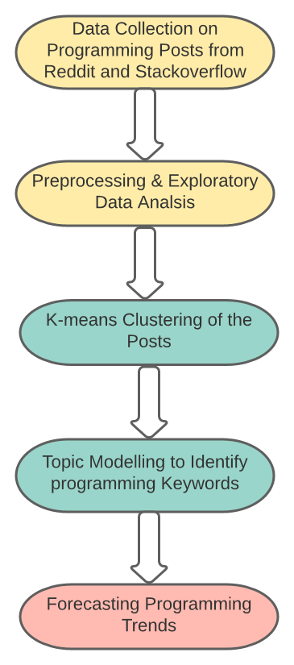

```{r setup, include=FALSE}
knitr::opts_chunk$set(echo = TRUE)
library(kableExtra)
library(dplyr)
library(jsonlite)
library(wordcloud) 
library(tm)
library(vistime)
library(stringr)
```

```{r reddit, echo=FALSE,warning=FALSE,message=FALSE}

       reddit_data <- fromJSON(url(paste("https://www.reddit.com/r/",
                          "coding",
                          "/new/.json?limit=",
                          100,sep="")),flatten = T)$data$children%>%
                      select("data.subreddit",
                             "data.title",
                             #"data.author",
                             #"data.selftext",
                             #"data.name",
                             "data.id",
                             #"data.domain",
                             #"data.url",
                             "data.created",
                             "data.created_utc",
                             "data.upvote_ratio",
                             "data.ups",
                             "data.score",
                             "data.num_comments"
                             )


      
```


## Background and Motivation

Reddit is known as the "Front Page of the Internet" and is a popular forum especially among young people where users can post anything and everything. Unlike other social media platforms the majority of the Reddit users remain anonymous. We believe that the anonymity of the forum allows us to train and test NLP models.
It has a large international community and a lot of programming related content. We want to use data from the Reddit forum in order to better understand the popularity of Programming languages among Reddit users.

Additionally we want to compare it to data from the Stackoverflow forum. The Stackoverflow forum is a forum that is more focussing on solving programming related Problems.

We want to evaluate what programming languages are being discussed in both forums and compare them. For reaching our aim we want to use Visualization and Machine Learning methods based on text data but also use the quantification that we get from the upvotes and number of comments.


## Research Questions

::: columns

:::: column

- Can we decide which topic/language a certain post is about?
- How do number of upvotes, comments and number of posts correlate to popularity?
- How does the popularity of programming languages change over time?
- Can we predict the popularity of programming languages in the future?
- How do the two platforms compare based on programming languages?

::::

:::: column
```{r reddit1, echo=FALSE,warning=FALSE,message=FALSE,fig.align = 'right'}
data_frame <- reddit_data %>% 
  select("data.id","data.title")%>%
  mutate(doc_id=data.id,
         text = data.title
         )%>%
  select("doc_id","text")
  
wordcloud(data_frame$text)
      
```
::::

:::


## Design overview
For the Reddit posts the plan is to use an API from Reddit to get data sets for a certain time range and a number of specific Subreddits. The choice of the Subreddits is crucial for the quality and expressiveness of our data and will be based on some prior research on interesting Subreddits regarding programming. From this data we can then get the Subreddit, title, text, upvotes and various metadata.

### Data set example

```{r reddit2, echo=FALSE,warning=FALSE,message=FALSE}


       reddit_data%>%
         head(3)%>%
         knitr::kable()%>%
         kable_paper("hover", full_width = F)
```
::: columns

:::: column

### Data Preprocessing
- Fetching the Reddit data from the pushshift API 
- Finding relevant subreddits
- Selecting the features that should be used 
- Textpreprocessing:
  - Removing punctuation and stopwords
  - Stemming
  - Vectorization


### Explorative Data Analyis and Visualization
- Exploratory data analysis using box plots, histograms, scatter plot etc. on upvotes and number of comments and number of posts for every programming language
- Showing the trend with a line plot and confidence interval
- Using 2D embedding of the posts and using a scatterplot to show similarity 
- Comparing stackoverflow and Reddit in the plots

### Classification of topics
- Using topic modeling using LDA - Latent Dirichlet Allocation
- Using decision trees or ensemble methods
- Using sentiment analysis and clustering to evaluate if a post is a professional question or an opinion

### Prediction of future popularity
- ARIMA
- SARIMA
- Exponential Smoothing
- Random Forest (based on CART)


### Shiny application
- Using shiny as a tool for interactive exploration of the data set
  - Sliders for selecting a time range of interest
  - Checkboxes or Dropdown menus to select different programming languages
- Bonus: Shiny offers the opportunity of refreshing the data sets on a web page making it possible to get new insights everyday

### Git URL

https://github.com/mthane/Rscraping.git
::::

:::: column



::::

:::
### Time plan

```{r timeplan, echo=FALSE,warning=FALSE,message=FALSE}

       read.csv("timeline.csv")%>%
          mutate(task=str_wrap(task,12))%>%
          vistime(
            col.event = "task",  
            col.group = "owner", 
            col.color= "color",
            title = "Project Timelines",
              linewidth = 90
        )
```

